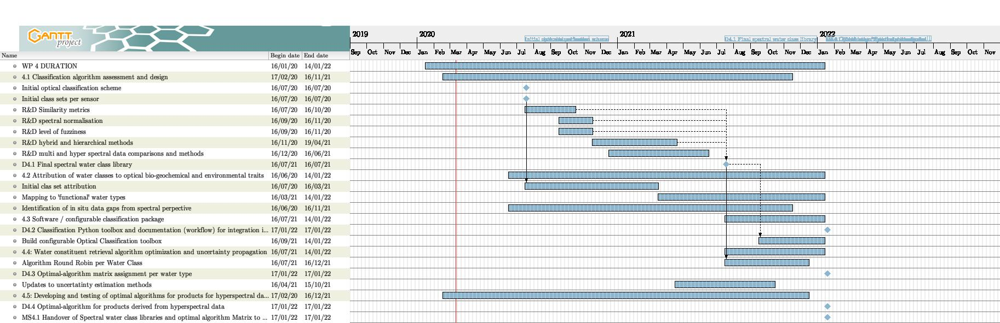

# Ocean water spectra classifier

This will become a python module for the fuzzy clustering of optical spectra.

## __Specification__: _Solution_

* __Easy to use__: _Scikit-learn syntax_ and available to users as a package through _pip install_

Enables integration into [scikit-learn pipelines](https://scikit-learn.org/stable/modules/generated/sklearn.pipeline.Pipeline.html). Useful for grid searching for the optimal parameters and joining up pre and post processing steps.

```
import fuzzy_water_clustering as fwc
cmeans = fwc.CmeansModel()

# generate a set of clusters to fit the data
# cluster configuration is held within the WaterClassifier instance
cmeans.fit(X, **kwargs)

# classify a set of data
Y = cmeans.predict(X)

# access attributes, eg. cluster centers
cmeans.cntr_

```

* __Self consistent repo__: _conda environment `.yml` file_

* __Flexible__:_can swap out estimators for different methods_

## Installation

This package is available to download and install via pip with the following command:

  `pip install fuzzy_clustering --no-deps --extra-index-url https://__token__:<personal_access_token>@gitlab.rsg.pml.ac.uk/api/v4/projects/340/packages/pypi/simple`

where, <personal_access_token> is a personal access token with at least `read_api` scope.

If you ever need to upgrade, just run `pip install --upgrade fuzzy_clustering ... etc` like above.

## Plan of action

1. build a framework for clusting data and scoring the cluster set
2. use framework to test out different clustering algorithms with different hyper parameters
3. find the best hyper parameters to use as default
4. generate a best effort class set for different sensors

## What we promised



overview google doc: https://docs.google.com/spreadsheets/d/1uoGp7u3A-hUjuZtvD6z0T5eiK2pyHwqqYJemsZEgY-g/edit?ts=5fc0d0df#gid=0
